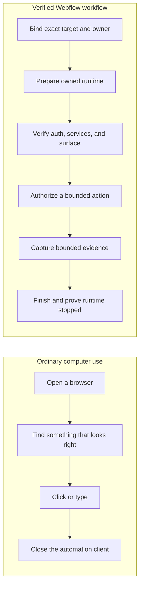
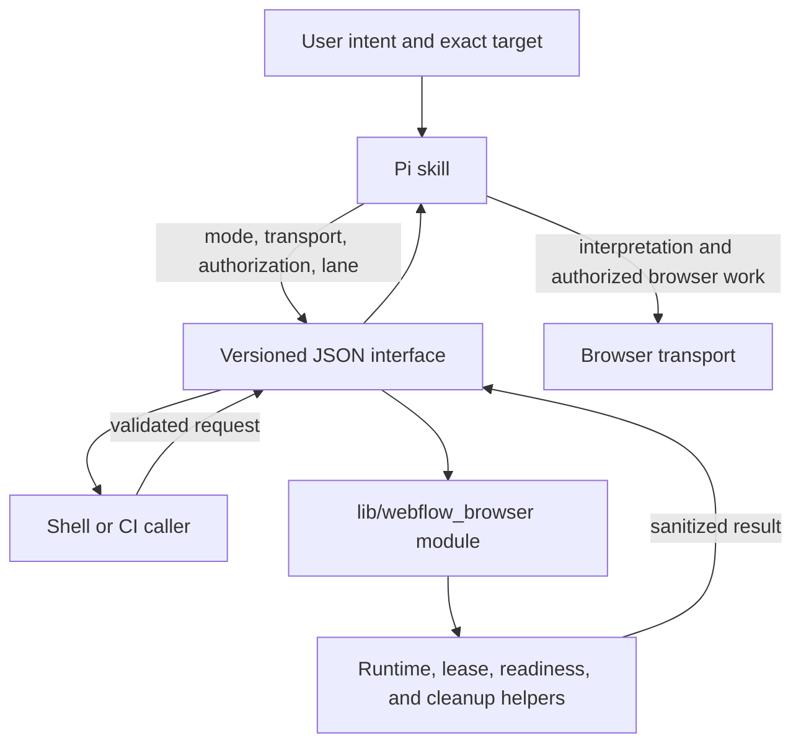
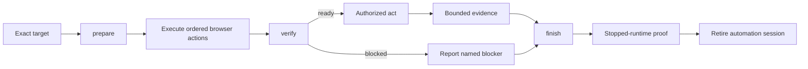
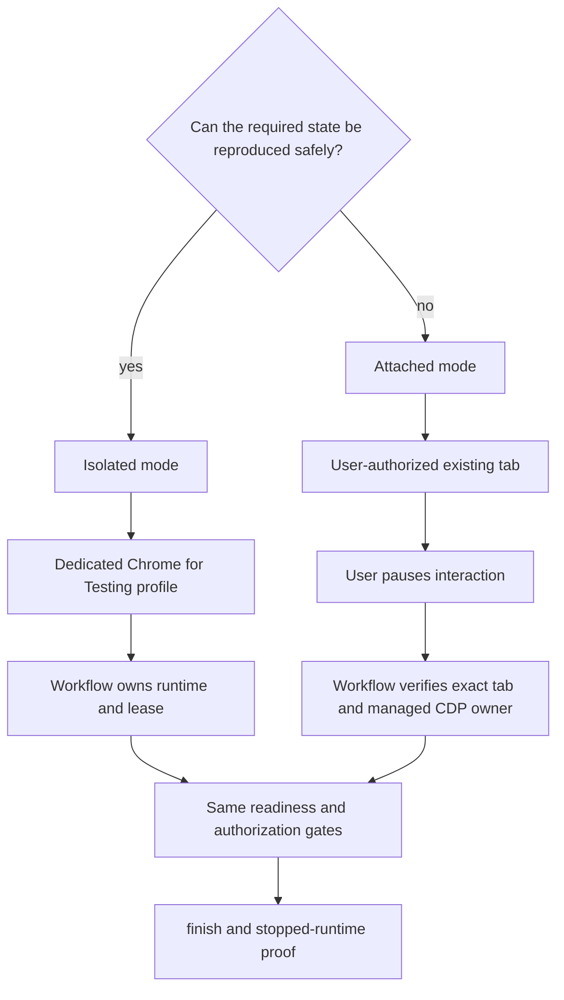

# A verified browser workflow for Webflow Designer

A browser command can succeed while the Webflow task has already failed. The
command may have opened a login page, an empty Designer shell, the wrong iframe,
or a tab with someone else's unsaved work. It may also leave Chrome running
after the automation client exits.

This skill treats a Designer run as a lifecycle that must be proved, not a
sequence of clicks that merely completed. It identifies the exact target,
establishes who owns the browser, checks authentication and the visible
Designer surface, separates observation from mutation, and proves cleanup at
the end.

The reader needs familiarity with Webflow Designer and a shell. Pi internals are
introduced where they first matter. For operational policy, go directly to
[`SKILL.md`](SKILL.md). For exact JSON fields and exit codes, use the
[`standalone CLI reference`](references/standalone-cli.md).

## The problem begins before the first click

"Use the browser and check the Designer" leaves several facts unstated. Which
Designer URL is approved? Is the open tab authenticated? Did the local Designer
service load, or did only its outer page load? Is the relevant surface in the
top document or an extension iframe? Can the agent safely edit what it sees?
Who will stop the browser?

Those questions correspond to concrete failure modes:

- a nearby tab or default host is mistaken for the requested target;
- the tab is a login or expired-auth page;
- Designer renders an empty shell while a local dependency is unavailable;
- an assertion runs in the wrong iframe;
- a shared or customer document contains live, collaborative, or unsaved state;
- an observational task drifts into navigation, selection, editing, or publish;
- browser state, page content, or credentials leak into durable evidence;
- the automation session closes before the owned Chrome process is proved
  stopped.

Ordinary computer-use instructions describe the desired action. They do not
prove the conditions that make the action safe. The design question for this
skill is narrower: how can an agent prove that it has the right target, browser
ownership, authenticated state, Designer surface, authorization, and cleanup
behavior before it reports success?



The left-hand path can be appropriate for a disposable public page. Designer is
different because its useful state may be authenticated, local, framed,
collaborative, or mutable.

## One contract, two responsibilities

The workflow separates judgment from repeatable lifecycle mechanics.

The Pi skill decides what the user asked for, whether the target is acceptable,
whether isolated or attached mode is justified, which interaction lane applies,
and what authorization is required. It interprets evidence and stops when a
named blocker appears.

The standalone `lib/webflow_browser` module owns deterministic mechanics. Its
versioned JSON interface prepares and identifies the managed runtime, coordinates
the selected transport, checks readiness, retains the transaction and lease,
and finishes with stopped-runtime proof. `bin/webflow-browser` exposes that
interface to shell and CI callers. `scripts/designer-code-mode.py` is the Pi
adapter at the same seam.



This is a deep module with a narrow interface. Callers learn a few operations
while the implementation keeps runtime identity, lease ownership, readiness,
Auth Vault ordering, recovery classification, and cleanup behind the seam. The
depth gives leverage to Pi and standalone callers. It also improves locality:
a lifecycle fix is made in the shared module instead of being repeated in each
caller. The deletion test explains why the module belongs. Removing it would
spread the same safety logic back across the CLI and Pi adapter.

## One run from target to teardown

A representative run follows the same order whether Pi or another host drives
the JSON interface.

1. **Identify the exact URL.** Preserve its scheme, host, port, path, and query
   string. Reject embedded credentials, fragments, and secret-bearing query
   names. Never infer a target from an unrelated tab.
2. **Choose ownership.** Isolated mode uses a dedicated Chrome for Testing
   profile and is the default. Attached mode is reserved for state that cannot
   be reproduced safely, such as an already-authenticated collaborative tab.
3. **Choose one transport.** Use native `agent_browser` when the host exposes
   it. Otherwise use the `agent-browser` CLI with a task-owned session name.
   Keep that transport through cleanup.
4. **Inspect Auth Vault.** The sessionless `agent-browser auth list` can identify
   an explicitly configured dedicated profile. Listing a profile does not prove
   that Webflow authentication is valid.
5. **Prepare the runtime.** Service probes run before Chrome starts. The core
   refuses an unknown live owner, starts the managed runtime, claims an exclusive
   lease, and returns ordered browser actions. Preparation emits no snapshot.
6. **Verify the surface.** After executing the returned actions, the caller
   submits compact URL, title, document, authentication, and scope observations.
   Verification rechecks services and runtime identity before classifying the
   Designer surface.
7. **Choose an interaction lane.** The fast lane is read-only observation after
   every readiness check passes. Navigation, selection, edits, undo, redo,
   publish, connected-app actions, and uncertain work use the guarded lane.
8. **Perform only authorized work.** Guarded work starts with a small baseline,
   one bounded action, and a verified postcondition. Account, security, privacy,
   production-control, destructive, and irreversible actions still require the
   authorization defined by the host and skill.
9. **Capture bounded evidence when needed.** Prefer semantic state. Use a
   screenshot for layout, spacing, color, or transformed canvas content. Keep
   traces, screenshots, and temporary reports outside the repository.
10. **Finish the transaction.** Release the exact lease and stop the owned
    runtime. A mismatch or cleanup failure is a blocker, not a partial success.
11. **Prove that Chrome stopped.** The result must report no runtime owner, no
    CDP listener, no consumer, and no lease.
12. **Close the automation session.** Retire the native or CLI session only
    after the stopped-runtime proof is returned.



An interrupted run begins with `status`. `reconcile` is available only for a
stale state that the classifier marks safe to recover. It never takes ownership
from another process.

## Ownership changes what the agent may assume

Isolated and attached mode share the same target, transport, readiness,
authorization, privacy, and cleanup rules. They differ in who owns the useful
browser state.



Attached mode is exceptional because another person's active state may be in
the tab. Attachment needs an exact URL, an authorized tab, a paused user, and a
verified managed browser owner. It begins read-only. The agent may not treat
attachment as permission to navigate or edit.

## What the checks buy the reader

The workflow does not guarantee that every browser action will succeed. It
makes the preconditions, effect, evidence, failure, and cleanup explicit.

- **Target identity:** the full approved URL is compared with the observed URL.
- **Ownership:** the transaction binds a runtime generation to one exclusive
  consumer lease. Unknown ownership blocks reuse.
- **Authentication:** Auth Vault can attempt login for one named dedicated
  profile, but only the observed non-login Designer surface proves readiness.
- **Readiness:** `hud`, `designer_service`, `target_http`, `browser_profile`, and
  `designer_surface` must all be ready before QA is allowed.
- **Authorization:** read-only observation and state-changing work use different
  lanes. Unclassified work is guarded or blocked.
- **Observation before mutation:** guarded work records a small baseline and
  checks the intended postcondition and unrelated state.
- **Privacy:** results are bounded and sanitized. The workflow does not return
  credentials, cookies, tokens, raw DOM, customer data, or full browser state.
- **Reproducibility:** one versioned request produces one deterministic JSON
  result, and one transport is retained for the transaction.
- **Failure classification:** input errors, readiness blockers, ownership
  conflicts, and cleanup failures have distinct results and exit codes.
- **Evidence quality:** semantic evidence comes before screenshots. Evidence is
  scoped to the verified target and kept temporary unless a sanitized report is
  required.
- **Cleanup:** success includes proof that the managed runtime and its lease are
  gone. Closing the automation client alone is not cleanup proof.

## Practical walkthrough

Set the skill path and use the real approved target. The values below are
synthetic and contain no account or customer data.

```sh
SKILL_DIR=/path/to/webflow-designer-agent-browser
CLI="$SKILL_DIR/bin/webflow-browser"
DESIGNER_URL='https://design.webflow.com/?pageId=synthetic-page'

agent-browser auth list
printf '%s\n' '{"version":1,"operation":"status"}' | "$CLI" status
```

If the sessionless Auth Vault list identifies a dedicated Webflow profile, pass
that exact name as `authProfile`. Omit the field when it does not. A native
request must not contain the CLI-only `session` field.

```sh
cat <<JSON | "$CLI" prepare
{
  "version": 1,
  "operation": "prepare",
  "transport": "native",
  "mode": "isolated",
  "target": "$DESIGNER_URL",
  "surface": "body",
  "readySelector": "body"
}
JSON
```

When the preceding list identified an exact dedicated profile, add
`"authProfile":"<exact-name-from-auth-list>"` to that request. Do not copy a
profile name from this guide or guess one.

A successful prepare result has `status:"prepared"`, a transaction ID, the
exact sanitized target, ordered `actions`, and a cleanup plan. It still reports
`classification:"browser_ready_pending_surface"` and
`blockers:["designer_surface"]`; browser startup is not Designer readiness.

After executing the actions in order, submit compact surface facts:

```sh
cat <<JSON | "$CLI" verify
{
  "version": 1,
  "operation": "verify",
  "transactionId": "<transaction-id-from-prepare>",
  "transport": "native",
  "surface": {
    "url": "$DESIGNER_URL",
    "title": "Webflow - Example site",
    "document": "designer",
    "authenticated": true,
    "errorPage": false,
    "scope": "body",
    "scopeObserved": true
  }
}
JSON
```

Proceed only for `status:"verified"`, `classification:"ready_for_qa"`, and
`qaLaunchAllowed:true`. A login page produces a blocker like this selected-field
example:

```json
{
  "version": 1,
  "status": "blocked",
  "classification": "auth_required",
  "qaLaunchAllowed": false,
  "transactionId": "<transaction-id-from-prepare>",
  "readiness": {
    "classification": "blocked_before_qa",
    "blockers": ["designer_surface"]
  }
}
```

The CLI exits `3` for that readiness or authentication blocker. It uses `2` for
an invalid command or request, `4` for an ownership or transaction conflict,
and `1` for a lifecycle or cleanup failure.

Finish after successful work, a blocker, or an interrupted browser action:

```sh
cat <<JSON | "$CLI" finish
{
  "version": 1,
  "operation": "finish",
  "transactionId": "<transaction-id-from-prepare>",
  "transport": "native"
}
JSON
```

The stopped proof has this shape:

```json
{
  "version": 1,
  "status": "finished",
  "classification": "finished",
  "runtimeStopped": true,
  "transactionId": "<transaction-id-from-prepare>",
  "cleanup": {
    "runtimeOwned": false,
    "cdpReady": false,
    "consumer": null,
    "leasePresent": false,
    "status": "stopped"
  }
}
```

Only then close the automation session named in the prepare result. See the
CLI reference for `cli` transport requests, direct helper checks, `reconcile`,
and the full request schema.

## Boundaries

This skill does not choose a target on the user's behalf, copy browser state
into the repository, bypass login, infer credentials, or add a new browser
transport. It does not use Playwright, Selenium, or Puppeteer for the managed
Designer lifecycle. Separate evidence-backed change validation may invoke fixed
reviewed Playwright runners from the Webflow repository; those runners do not
replace this browser lifecycle.

The user or host still authorizes attached access and state-changing work.
Purchases, production control, destructive or irreversible actions, and
account, security, or privacy changes keep their normal approval requirements.
The workflow stops for a missing exact target, unavailable transport, failed
service probe, unknown browser owner, absent or invalid authentication,
unverified Designer surface, lease or runtime mismatch, stale state that is not
safe to reconcile, or failed cleanup.

Credentials and browser state stay private because the workflow passes only a
named Auth Vault profile into the action plan and accepts only compact surface
facts back. Profiles, runtime files, screenshots, traces, and temporary evidence
belong in private runtime or temporary directories outside this repository.

## Further reading

- [`SKILL.md`](SKILL.md): concise operational policy, routing, authorization,
  and stop conditions for Pi.
- [`references/standalone-cli.md`](references/standalone-cli.md): exact lifecycle
  commands, JSON fields, exit codes, browser requirements, and direct helpers.
- [`references/designer-workflows.md`](references/designer-workflows.md): local
  services, iframe selection, assertion order, diagnostics, and evidence.
- [`references/change-validation-guide.md`](references/change-validation-guide.md):
  user-facing workflow for validating a Webflow code change.
- [`references/evidence-compiler-architecture.md`](references/evidence-compiler-architecture.md):
  the separate offline evidence compiler and reviewed runtime validator.
- [`references/connected-apps.md`](references/connected-apps.md): connected-app
  state and mutation rules.
- [`references/test-knowledge-maintenance.md`](references/test-knowledge-maintenance.md):
  maintenance-only corpus and scenario planning.
- [`references/webflow-browser-cli-architecture.html`](references/webflow-browser-cli-architecture.html):
  self-contained visual guide to responsibility and interaction lanes.
- [`references/webflow-browser-cli-lifecycle.html`](references/webflow-browser-cli-lifecycle.html):
  self-contained visual guide to ownership, readiness, recovery, and cleanup.

The two HTML guides were built with the
[`wf-viz`](https://github.com/webflow/wf-viz) template, tokens, runtime, and
hostile-host checks. They contain no live browser capture or private state and
make no network request when opened.
