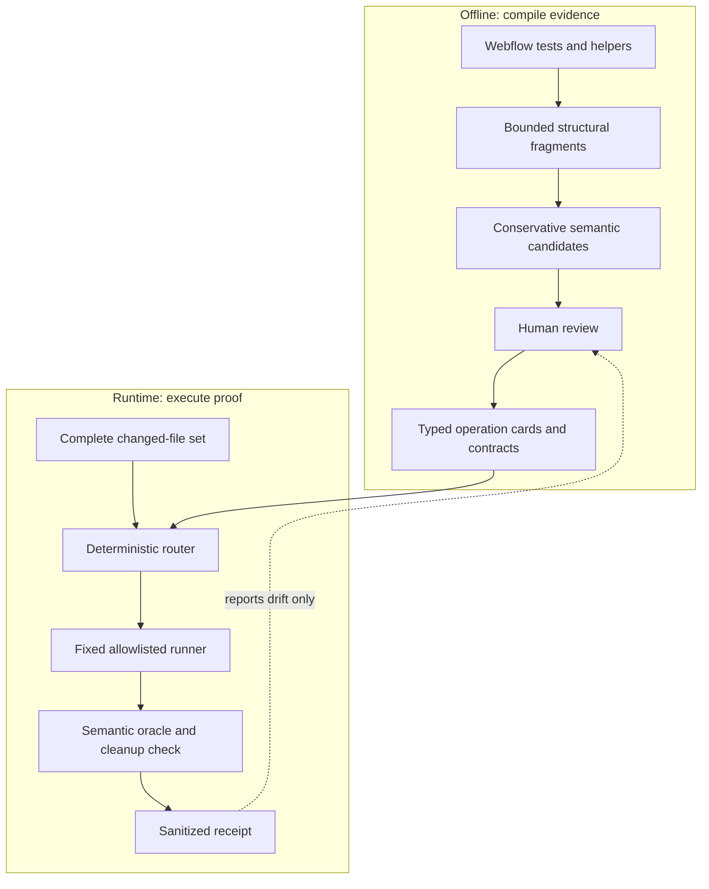

# How evidence-compiled change validation works

The Webflow Designer validator has two separate jobs. Offline, it reads a large and uneven test corpus and turns reviewed evidence into small contracts. At runtime, it routes a code change to a fixed test runner, checks the visible end state, and emits a compact receipt.

This separation keeps routine validation cheap and predictable. A known change uses no model call. An unknown change can produce one bounded proposal. A person must approve its exact digest before it can run. A runtime result cannot update the trusted policy or promote itself into a reusable contract.

The work landed in [PR #3](https://github.com/javonmcgilberry/my-pi-setup/pull/3), merged as [`f7b54b7`](https://github.com/javonmcgilberry/my-pi-setup/commit/f7b54b7b8e10ac4c9a19e201733effb5be9d32a3). The final hardening commit is [`095c4f8`](https://github.com/javonmcgilberry/my-pi-setup/commit/095c4f8b0f486879d9c802fc7d66015cf4c7c877).

## The architecture



The blocked feedback path matters. A receipt can tell a reviewer that something drifted. It cannot flow backward and change the contract that selected the runner. That prevents a browser run, a stale selector, or a model proposal from becoming trusted behavior by accident.

## Why the system compiles evidence first

Webflow tests contain useful knowledge about what a panel, page switch, or shortcut should do. They also contain things that are unsafe to treat as proof: old selectors, shared helpers, fixture assumptions, raw waits, destructive actions, quarantined tests, and assertions that only show a click happened.

A simple count of similar tests would be misleading. Two tests that call the same helper may share one wrong assumption. Two different buttons may both look like "click and wait" in source code. A test that happens often is not automatically a reliable specification.

The compiler avoids that shortcut in `scripts/test-corpus-index.py`.

```python
# semantic_identity, test-corpus-index.py:546-575
if features["actionTargets"]:
    kind, seed, bound = "selector-target", features["actionTargets"], True
elif features["helperCalls"]:
    kind, seed, bound = "helper-call", features["helperCalls"], True
else:
    kind = "unanchored"
    seed = {"path": relative_path, "lineStart": line_start, "lineEnd": line_end}
    bound = False

return {"kind": kind, "bound": bound, "digest": sha256_json(seed)[:16]}
```

The compiler hashes an action target when it has one. If it lacks a target, it hashes a helper call. If it has neither, it marks the fragment unanchored and keeps it unique. In particular, an unanchored fragment cannot corroborate another fragment merely because both contain a generic action.

`fragment_features` canonicalizes only bounded literal target forms: direct
selector literals, a single `data-testid` CSS locator, a literal role/name
pair, and a local alias created from a literal `getByTestId`. Dynamic selector
values are not promoted to selector targets; an existing helper-call anchor
still follows the normal conservative rule.

This is a deliberate bias. Missing a possible grouping costs review effort. Merging evidence for two different targets can create a false pass.

## What the offline compiler produces

`structural_fragments` and `fragment_features` extract behavior-sized pieces from allowed Playwright and Cypress sources. `fragment_record` records each piece's framework, subsystem, line range, source kind, semantic signals, and hashed lineage. `candidate_id` then combines framework, subsystem, structural signature, and semantic identity.

`build_discovery` groups only those conservative candidate IDs. It excludes quarantined, fixture-dependent, destructive, and raw-wait evidence from positive evidence. It also sets aside a holdout only when that holdout has independent lineage. Two tests that call the same helper do not count as independent just because they are in different files.

The discovery report is a review artifact, not an executable one. Its promotion checks require all of the following:

- a bound semantic identity;
- a semantic assertion, rather than action similarity alone;
- independent corroboration;
- an independent holdout;
- no unsafe evidence; and
- the invariant `notRuntimePromoted: true`.

`validate_discovery` rejects stale report versions, malformed identity hashes, unanchored corroboration, lineage leakage, and count or coverage drift. The final read-only run over the Webflow source tree produced 4,462 fragments and 3,189 candidates, with zero unanchored corroborations.

The current trusted seed is intentionally small: opening Pages, Components, and Add panels, dismissing panels, and switching pages. Expansion starts with review of one operation family at a time, not a promise to learn any site.

## The hardening oracle stays offline

`scripts/webflow-hardening-benchmark.py --repo . --format verify` is a frozen synthetic oracle for the compiler and runtime boundaries. Its fixtures cover semantic identity, provenance and lineage, artifact tampering, routing and approval, runner classification, lifecycle leases, privacy canaries, and bounded scale. It uses temporary Git repositories and fake state only; it never opens a browser, reads credentials, contacts Webflow, or promotes evidence.

A separate isolated campaign ran exactly 100 bounded experiments: 12 identity/parser trials followed by 88 provenance, artifact, routing, runner, lifecycle, privacy, performance, and simplification trials. Every retained candidate kept all hard safety metrics at zero and deterministic output. No candidate was auto-promoted. After independent review and complete affected-module tests, only bounded method-scan consolidation was adopted; the frozen safety oracle and evidence boundaries were unchanged.

## Runtime has two paths

`route_trusted_contracts` reads the complete set of non-ignored changed files. It does not quietly validate the paths it recognizes and ignore the rest.

| Path | When it applies | Model use | Result |
|---|---|---:|---|
| D0, trusted route | Every changed product path maps to one reviewed runner | 0 | Run the fixed scenario |
| D1, candidate route | A path is unknown but bounded evidence is available | At most 1 proposal | Require exact human approval before one run |
| Stop | A path is ambiguous or lacks evidence | 0 | Return `routing_ambiguous` or `insufficient_evidence` |

Known paths go through D0. The policy maps them to fixed operation IDs and fixed runners. For example, a Pages panel change maps to the reviewed Pages panel scenario. The runtime does not ask a model which test sounds relevant.

An unknown path can reach D1. `build_proposal_context` exposes only a bounded context. A model or engineer may describe one candidate contract, but the contract must pass the same policy checks as any other input. D1 is a narrow escape hatch, not an open-ended browser agent.

## The contract is typed data, not a script

`schemas/designer-validation-contract.schema.json` defines a closed Validation Contract IR. It binds the proposal to the exact source commit and changed-file digest. It has typed facts, a small acyclic action graph, one semantic oracle, a cleanup requirement, and fixed budgets. A semantic oracle is the typed check that asks whether the required end state is true.

```json
{
  "mode": "candidate",
  "riskClass": "reversible-ui",
  "actions": [
    {
      "id": "open",
      "op": "invoke_operation",
      "dependsOn": [],
      "operationId": "designer.panel.pages.open"
    },
    {
      "id": "prove",
      "op": "assert",
      "dependsOn": ["open"],
      "fact": "pages.visible",
      "expected": true
    }
  ],
  "oracle": {
    "kind": "semantic-fact",
    "fact": "pages.visible",
    "expected": true
  },
  "cleanup": ["adapter-teardown"],
  "budget": {"timeoutSeconds": 900, "maxRetries": 1, "maxActions": 8}
}
```

This is illustrative of the schema, not an executable fixture. The actual validator, `validate_candidate_contract`, checks more than the JSON shape:

- The source commit and change digest must match the current change set.
- The candidate must cite a reviewed runner selected by the bounded context.
- It may use only approved risk classes, targets, operations, selector keys, and action types.
- It may have no more than eight actions and one retry.
- Its oracle must be a typed semantic fact.
- Cleanup must include `adapter-teardown`.
- Its timeout, retry, and action budget must equal the reviewed runner's tracked budget.

There is no field for JavaScript, shell commands, arbitrary browser commands, or unbounded loops. The policy owns the runner command. The candidate only selects from a small reviewed vocabulary.

## Approval is tied to the exact contract

`DesignerCodeMode._validate_change` exposes five phases: route, execute a trusted route, request proposal context, submit a candidate, and execute a candidate.

When a candidate is submitted, the system returns a digest-bound summary of its evidence, target, risk class, actions, oracle, cleanup, and budget. To run it, the caller provides only the full approval digest; the Pi host issues a short-lived one-time confirmation token after interactive approval, and Code Mode consumes that token together with the digest. `DesignerCodeMode._claim_candidate_execution` rejects a changed digest, missing proposal state, a binding mismatch, or a candidate that already ran.

The candidate becomes consumed in a `finally` block. It cannot be retried under the same approval after a failure. That makes approval specific and sends a failed candidate back to review instead of an uncontrolled retry loop.

## The receipt separates failure types

The fixed runner is still the runner that the tracked policy selected. `default_runner` keeps a small private output buffer only long enough to classify a result. It discards the raw text. The public receipt has no field for runner output.

| What happened | Semantic oracle | Cleanup | Why |
|---|---|---|---|
| The fixed runner completed | `passed` | `proved` | The scenario completed its declared oracle and teardown. |
| The semantic assertion failed | `failed` | `not_proved` | The final state was wrong. The failed process did not prove teardown. |
| Timeout, setup, infrastructure, or unknown failure | `not_run` | `not_proved` | The process did not prove the full contract. |
| Explicit teardown failure | `not_run` | `failed` | The runner explicitly reported cleanup failure. |

`classify_runner_failure` owns these distinctions. `execute_runner` returns `passed` only when every selected fixed runner succeeds, its semantic oracle passes, and cleanup is proved.

This avoids treating every nonzero exit code as an assertion failure. It also avoids saying cleanup succeeded when no evidence proves it did.

## Existing browser ownership remains intact

The validator does not replace `agent_browser`, create a general CDP browser agent, or put arbitrary browser code in the contract. It selects fixed Webflow scenarios. `test-scenario-eval.py::build_plan` can describe external setup, managed browser, assertion, and teardown phases, but it does not execute the Playwright adapter.

The existing Webflow scenario utilities keep ownership of their Playwright contexts. That limits the surface of this change and avoids a competing browser lifecycle.

## PICO: the frame that sharpened the design

PICO is a way to state a problem, an intervention, a comparison, and the desired outcomes. It is used here to evaluate the architecture, not to claim this work is a clinical study.

- **Problem / population:** Webflow Designer changes where correctness depends on browser-visible application state and existing test evidence.
- **Intervention:** Compile tests, helper metadata, and reviewed evidence offline. At runtime, execute typed contracts with fixed runners, semantic oracles, and cleanup proof.
- **Comparison:** Open-ended browser reasoning on every change, raw trajectory replay, action-similarity scoring, LLM-as-judge verdicts, ad hoc test selection, and runtime self-evolution.
- **Outcomes:** Zero routine model calls for known routes, at most one proposal for an unknown route, deterministic routing, bounded execution, semantic end-state evidence, honest cleanup state, small public receipts, and no automatic promotion.

The architecture existed before the 1K Papers review. That review helped test the design against recent work and made the boundaries clearer.

| Paper | Specific lesson used | Decision |
|---|---|---|
| [Recursive Language Models](https://arxiv.org/abs/2512.24601) | Treat a large input as an external environment that can be decomposed. | Adopt offline decomposition. Do not use recursive model calls for routine runtime validation. |
| [GameWorld](https://arxiv.org/abs/2604.07429) | Evaluate browser tasks with state-verifiable outcome metrics. | Adopt semantic outcomes. Defer any claim of broad benchmark coverage. |
| [MobileGym](https://arxiv.org/abs/2605.26114) | Use deterministic state-based judging over structured state. | Adopt typed semantic facts. Defer a full forkable Webflow simulation. |
| [OpenComputer](https://arxiv.org/abs/2605.19769) | App-specific hard-coded verifiers can match human adjudication better than LLM judges for fine-grained state. | Adopt app-specific oracles and auditable receipts. Reject runtime self-modification of verifiers. |
| [Program-as-Weights](https://arxiv.org/abs/2607.02512) | Pay an expensive compilation cost once and reuse a cheaper artifact. | Adopt compile once, execute cheaply. Keep the artifact inspectable typed data rather than weights. |
| [SkillRL](https://arxiv.org/abs/2602.08234) | Distill noisy trajectories into compact reusable skills. | Adopt compact operation cards. Reject runtime rollout ingestion and recursive evolution. |
| [DeepSearch-World](https://arxiv.org/abs/2607.07820) | Deterministic tools support progress checks, grounded reflection, and recovery. | Adopt deterministic tools and bounded recovery. Reject self-distillation as a promotion path. |
| [The Devil Behind Moltbook](https://arxiv.org/abs/2602.09877) | Continuous self-evolution without sufficient oversight creates safety risks. | Keep external review in promotion. Reject a closed loop that rewrites its own policy. |

## The small set of things a pass means

A passing receipt means the chosen fixed runner completed its declared semantic oracle and teardown for that run. It does not prove that every Webflow path is correct. A semantic identity hash reduces report leakage, but does not prove a selector is fresh. A repeated test pattern is still evidence, not truth.

That restraint is the point. The validator is designed to stop when it lacks evidence, show what it did prove, and move learning to a separate review step.

## Code map

- `skills/webflow-designer-agent-browser/scripts/test-corpus-index.py:372-756,1205-1382`: extraction, feature analysis, semantic identity, candidate grouping, holdouts, coverage, and discovery validation.
- `skills/webflow-designer-agent-browser/scripts/validate-change.py:438-952`: routing, proposal context, candidate validation, output classification, receipts, and execution.
- `skills/webflow-designer-agent-browser/scripts/designer-code-mode.py:1747-1963`: candidate state, digest-bound approval, one-run claiming, and the `validate_change` interface.
- `skills/webflow-designer-agent-browser/schemas/designer-validation-contract.schema.json`: the closed candidate contract.
- `skills/webflow-designer-agent-browser/schemas/designer-validation-receipt.schema.json`: the compact public receipt.
- `skills/webflow-designer-agent-browser/test-corpus-policy.json`: source roots, operation seed, mappings, runners, budgets, and allowlists.
- `skills/webflow-designer-agent-browser/references/compounding-loop.md`: promotion and non-promotion rules.

## References

1. Alex L. Zhang, Tim Kraska, and Omar Khattab. "Recursive Language Models." arXiv:2512.24601, submitted 2025-12-31. <https://arxiv.org/abs/2512.24601>
2. Mingyu Ouyang, Siyuan Hu, Kevin Qinghong Lin, Hwee Tou Ng, and Mike Zheng Shou. "GameWorld: Towards Standardized and Verifiable Evaluation of Multimodal Game Agents." arXiv:2604.07429, submitted 2026-04-08. <https://arxiv.org/abs/2604.07429>
3. Dingbang Wu, Rui Hao, Haiyang Wang, Shuzhe Wu, Han Xiao, Zhenghong Li, Bojiang Zhou, Zheng Ju, Zichen Liu, Lue Fan, and Zhaoxiang Zhang. "MobileGym: A Verifiable and Highly Parallel Simulation Platform for Mobile GUI Agent Research." arXiv:2605.26114, submitted 2026-05-25. <https://arxiv.org/abs/2605.26114>
4. Jinbiao Wei, Qianran Ma, Yilun Zhao, Xiao Zhou, Kangqi Ni, Guo Gan, and Arman Cohan. "OpenComputer: Verifiable Software Worlds for Computer-Use Agents." arXiv:2605.19769, submitted 2026-05-19. <https://arxiv.org/abs/2605.19769>
5. Wentao Zhang, Liliana Hotsko, Woojeong Kim, Pengyu Nie, Stuart Shieber, and Yuntian Deng. "Program-as-Weights: A Programming Paradigm for Fuzzy Functions." arXiv:2607.02512, submitted 2026-07-02. <https://arxiv.org/abs/2607.02512>
6. Peng Xia, Jianwen Chen, Hanyang Wang, Jiaqi Liu, Kaide Zeng, Yu Wang, Siwei Han, Yiyang Zhou, Xujiang Zhao, Haifeng Chen, Zeyu Zheng, Cihang Xie, and Huaxiu Yao. "SkillRL: Evolving Agents via Recursive Skill-Augmented Reinforcement Learning." arXiv:2602.08234, submitted 2026-02-09. <https://arxiv.org/abs/2602.08234>
7. Xinyu Geng, Xuanhua He, Sixiang Chen, Yanjing Xiao, Fan Zhang, Shijue Huang, Haitao Mi, Zhenwen Liang, Tianqing Fang, and Yi R. Fung. "DeepSearch-World: Self-Distillation for Deep Search Agents in a Verifiable Environment." arXiv:2607.07820, submitted 2026-07-08. <https://arxiv.org/abs/2607.07820>
8. Chenxu Wang, Chaozhuo Li, Songyang Liu, Zejian Chen, Jinyu Hou, Ji Qi, Rui Li, Litian Zhang, Qiwei Ye, Zheng Liu, Xu Chen, Xi Zhang, and Philip S. Yu. "The Devil Behind Moltbook: Anthropic Safety is Always Vanishing in Self-Evolving AI Societies." arXiv:2602.09877, submitted 2026-02-10. <https://arxiv.org/abs/2602.09877>

Paper metadata and abstracts were checked against the arXiv API on 2026-08-20 UTC. Implementation facts come from PR #3 and its repository tests.
